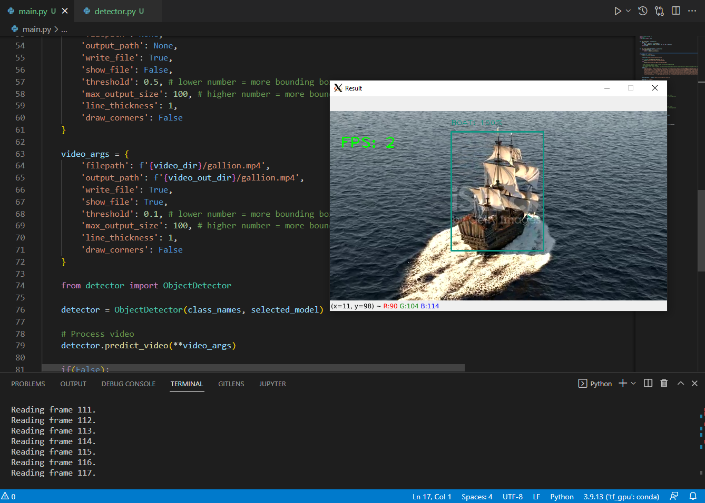

<h1>Object Detection Pipeline Class for Tensorflow</h1>

<h4>Demonstrates Object Detection and Classification with Pretrained Tensorflow Models</h4>

<h2>1. Set Up a Python Tensorflow Environment with Anaconda</h2>
<p>If you do not already have it, install Anaconda or at least Miniconda to set up a Tensforflow environment.</p>
<ul>
    <li>Download and install <a href="https://docs.anaconda.com/anaconda/install" target="_blank">Anaconda</a></li>
    <li>OR</li>
    <li>Download and install <a href="https://docs.conda.io/en/latest/miniconda.html" target="_blank">Miniconda</a> for minimal footprint.</li>
</ul>

<p>1a. After installing, create a new Tensforflow environment by running at the command line:</p>

```{bash}
conda create -n tf python==3.9

conda activate tf
```

<p>2a. Be sure to install <a href="https://pypi.org/project/opencv-python/" target="_blank">OpenCV</a> after activating the environment.</p>

```
python3 -m pip install opencv-python
```

<h2>3. Install Tensorflow</h2>
<p>You can read the installation instructions and install from <a href="https://www.tensorflow.org/install" target="_blank">Tensorflow.org</a></p>

<p>The <code>ObjectDetector</code> class was inspired by this tutorial on <a href="Video tutorial: https://www.youtube.com/watch?v=2yQqg_mXuPQ" target="_blank">YouTube</a></p>

<p>This entry point for this repo is <code>main.py</code></p>

<h2>4. Refresh the Models</h2>

<p>Run <code>refresh_model_urls.py</code> to update the models in <code>./resources/models.json</code>.</p>

<p>See <code>main.py</code> for usage of the pipeline and to execute samples.</p>

<p></p>
