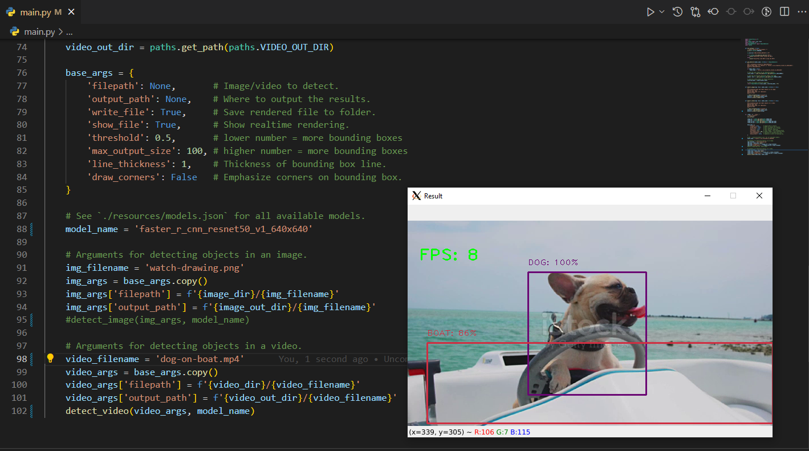

<style language="text/css">
h1, h2 {color: #A11015;}
</style>

<h1>Object Detection Pipeline Class for Tensorflow</h1>

<h4>Demonstrates Object Detection and Classification with Pretrained Tensorflow Models</h4>

<h2>Set Up a Python Tensorflow Environment with Anaconda</h2>
<p>If you do not already have it, install Anaconda or at least Miniconda to set up a Tensforflow environment.</p>
<ul>
    <li>Download and install <a href="https://docs.anaconda.com/anaconda/install" target="_blank">Anaconda</a></li>
    <li>OR</li>
    <li>Download and install <a href="https://docs.conda.io/en/latest/miniconda.html" target="_blank">Miniconda</a> for minimal footprint.</li>
</ul>

<p>After installing, create a new Tensforflow environment by running at the command line:</p>

`conda create -n tf python==3.9`

<h2>Install Tensorflow</h2>
<p>You can read the installation instructions and install from <a href="https://www.tensorflow.org/install" target="_blank">Tensorflow.org</a></p>

<p>The <code>ObjectDetector</code> class was inspired by this tutorial on <a href="Video tutorial: https://www.youtube.com/watch?v=2yQqg_mXuPQ" target="_blank">YouTube</a></p>

<p>This entry point for this repo is <code>main.py</code></p>

<p>Pretrained model URLs for this demonstration can be obtained from the <a href="https://github.com/tensorflow/models/blob/master/research/object_detection/g3doc/tf2_detection_zoo.md" target="_blank">Tensorflow Models Repository</a></p>

<p>Example: Copy and paste a URL to the <code>models</code> dictionary object in <code>main.py</code>.</p>

```{Python}
models = {
    'ssd_mobilenet': 'http://download.tensorflow.org/models/object_detection/tf2/20200711/ssd_mobilenet_v2_320x320_coco17_tpu-8.tar.gz',
    'efficientdet_d4': 'http://download.tensorflow.org/models/object_detection/tf2/20200711/efficientdet_d4_coco17_tpu-32.tar.gz',
    'faster_rcnn': 'http://download.tensorflow.org/models/object_detection/tf2/20200711/faster_rcnn_resnet50_v1_1024x1024_coco17_tpu-8.tar.gz',
    'mask_rcnn_inception_resnet': 'http://download.tensorflow.org/models/object_detection/tf2/20200711/mask_rcnn_inception_resnet_v2_1024x1024_coco17_gpu-8.tar.gz',
    'efficientdet_d7': 'http://download.tensorflow.org/models/object_detection/tf2/20200711/efficientdet_d7_coco17_tpu-32.tar.gz',
    'centernet_mobilenet': 'http://download.tensorflow.org/models/object_detection/tf2/20200711/centernet_resnet50_v2_512x512_coco17_tpu-8.tar.gz'
}
```

<p>See <code>main.py</code> for usage of the pipeline and to execute samples.</p>

<p></p>
